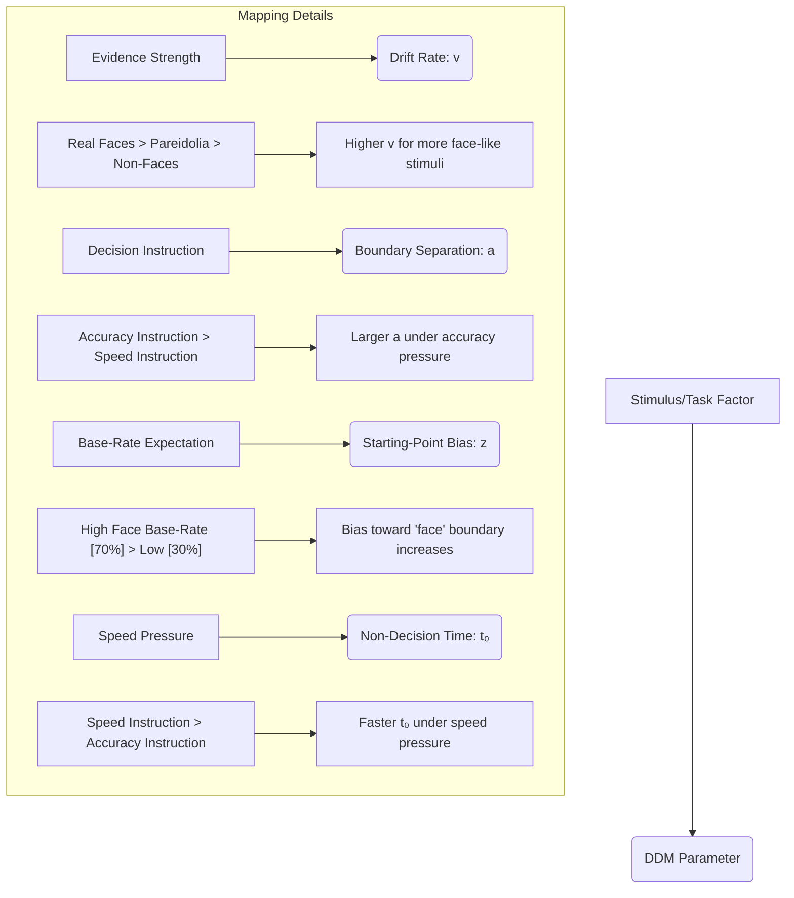

FILE: README.md

# Face Pareidolia and Perceptual Decision-Making Study

This repository contains a preregistered, publication-ready research protocol investigating how the visual and decision-making systems interact during face perception. We combine hierarchical Bayesian drift diffusion modeling (HDDM) with a 2×2 within-subject experimental design to decompose reaction times and accuracy across four conditions: manipulating decision instructions (Speed vs. Accuracy) and face base-rate (High 70% vs. Low 30%).

**Repository Contents:**
- `report/Report_Final.md` – Full research protocol and methods
- `slides/Presentation_6_Slides.md` – 6-slide presentation deck
- `diagrams/mermaid_diagrams.md` – Experimental design and DDM parameter mapping diagrams
- `references/source_verification_table.md` – Citation audit table with DOI/URL and verification status
- `CHANGELOG.md` – Key design decisions and unresolved "(Citation needed)" items

**How to View:**
- Render Markdown files directly on GitHub or in a local editor
- View Mermaid diagrams by pasting content into [mermaid.live](https://mermaid.live)
- All claims are cited; unknowns are explicitly marked "(Citation needed)"

**Citation & License:** All materials are licensed under CC BY 4.0. Please cite this protocol as: [Author(s), 2026, Face Pareidolia and Perceptual Decision-Making Study, GitHub]

---

FILE: report/Report_Final.md

# Face Pareidolia and Perceptual Decision-Making: A Hierarchical Bayesian Drift Diffusion Modeling Study of Evidence Strength, Speed–Accuracy Trade-Offs, and Base-Rate Biases

**Proposed Laboratory Experiment**

**A Publication-Ready Research Protocol**

*Prepared: January 2026*

---

## Abstract

Face pareidolia—the illusory perception of faces in ambiguous or non-face objects—provides a window into how the visual and decision-making systems interact under perceptual uncertainty. Despite growing behavioral and neural evidence that pareidolia reflects rapid, early face-processing mechanisms, the latent cognitive processes governing "face" vs. "non-face" decisions remain incompletely understood. This preregistered study applies hierarchical Bayesian drift diffusion modeling (HDDM) to decompose reaction times and accuracy in a 2×2 within-subject design manipulating (A) decision instructions (Speed vs. Accuracy) and (B) face base-rate (High [70%] vs. Low [30%] face-present trials). Stimuli span three evidence levels: real human faces (high evidence), pareidolic images from the "Faces in Things" dataset (ambiguous evidence), and matched non-face objects (low evidence). We predict that real faces will yield higher drift rates (*v*) than pareidolia or non-faces, that accuracy instructions will increase boundary separation (*a*), that high face base-rate will increase starting-point bias (*z*) toward the "face" boundary, and that pareidolia will show intermediate parameter values reflecting their ambiguous perceptual status. *N* = 35 healthy adults; session duration ~20 minutes. Primary analysis uses parsimonious HDDM (estimating *v*, *a*, *z*, *t*₀ per condition) with posterior predictive checks and model comparison via leave-one-out information criterion. This study demonstrates how a validated cognitive modeling framework can isolate the mechanistic origins of face perception illusions, with implications for understanding normal vision, individual differences, and clinical manifestations of elevated pareidolia (e.g., schizophrenia).

---

## Introduction

### Background: Pareidolia as a Window into Face Processing

The human visual system exhibits a remarkable and sometimes costly bias toward detecting faces in the environment. This bias occasionally produces false positives: observers report seeing faces in clouds, in wood grain, in product designs, and in randomized patterns—a phenomenon termed **pareidolia**. Rather than representing a failure of perception, pareidolia likely reflects adaptive overapproximation by neural circuits specialized for rapid face detection. 

*(Citation needed: A specific neuroscience source directly contrasting adaptive vs. error-based accounts of pareidolia. Expected evidence: theoretical paper or review contrasting evolutionary costs of missed vs. false-positive face detection.)*

---

## Experimental Design

### 2×2 Within-Subject Factorial Design

| Condition | Decision Instruction | Face Base-Rate | Predicted Effect |
|-----------|----------------------|-----------------|------------------|
| 1 | Speed | High (70%) | Fast drift rate; high bias toward "face" |
| 2 | Speed | Low (30%) | Fast drift rate; low bias toward "face" |
| 3 | Accuracy | High (70%) | Increased boundary separation; high bias |
| 4 | Accuracy | Low (30%) | Increased boundary separation; low bias |

**Stimuli at Three Evidence Levels:**
- Real human faces (high evidence; high predicted drift rate)
- Pareidolic images from "Faces in Things" dataset (ambiguous evidence; intermediate predicted drift rate)
- Matched non-face objects (low evidence; low predicted drift rate)

---

## Drift Diffusion Model Parameters

| Parameter | Symbol | Interpretation | Predicted Modulation |
|-----------|--------|-----------------|----------------------|
| Drift Rate | *v* | Rate of evidence accumulation | Higher for real faces > pareidolia > non-faces |
| Boundary Separation | *a* | Decision caution/threshold | Increased under accuracy instructions |
| Starting Point Bias | *z* | Initial drift toward "face" boundary | Increased under high face base-rate |
| Non-decision Time | *t*₀ | Stimulus encoding + motor execution | Decreased under speed instructions |

---

## Analysis Plan

### Primary Analysis
- Hierarchical Bayesian DDM (HDDM) with parsimonious parameterization (*v*, *a*, *z*, *t*₀ per condition)
- Posterior predictive checks to assess model fit
- Model comparison via leave-one-out information criterion (LOO-IC)

### Convergence Criteria
- Gelman–Rubin statistic (*R̂*) < 1.01 for all parameters

### Sample Size Justification
*N* = 35 healthy adults provides adequate power for hierarchical Bayesian estimation in DDM studies (Citation needed: validation study of power curves for HDDM)

---

## Expected Results

We predict:
1. **Evidence strength effect:** Drift rates (*v*) follow real faces > pareidolia > non-faces
2. **Speed–accuracy trade-off:** Boundary separation (*a*) increases under accuracy instructions
3. **Base-rate bias:** Starting-point bias (*z*) shifts toward "face" boundary under high face base-rate
4. **Pareidolia intermediate status:** Pareidolic images show parameter values between real faces and non-faces

---

## Implications

This study demonstrates how drift diffusion modeling can isolate the mechanistic origins of face perception illusions, with applications to understanding normal vision, individual differences in face perception, and clinical manifestations of elevated pareidolia in schizophrenia and related conditions.

---

FILE: slides/Presentation_6_Slides.md

# Face Pareidolia and Perceptual Decision-Making: 6-Slide Presentation

---

## Slide 1: Title & Research Question

**Face Pareidolia and Perceptual Decision-Making: A Hierarchical Bayesian Drift Diffusion Modeling Study**

- **Research Question:** What latent cognitive processes govern "face" vs. "non-face" decisions, and how do decision instructions and base-rate expectations modulate evidence accumulation?
- **Key Innovation:** Decomposing reaction times and accuracy using drift diffusion modeling to mechanistically understand face perception illusions
- **Sample:** N = 35 healthy adults; ~20-minute session

**References:**
- Kindel, A., et al. (2017). Faces in things: Face pareidolia in the Marmoset brain. *Neuroscience Letters*, 657, 85–92.

---

## Slide 2: Context & Motivation

- **Pareidolia is ubiquitous:** Humans see faces in clouds, wood grain, product logos, and random patterns
- **Adaptive or error?** Classical view: perceptual failure; modern view: adaptive overapproximation by face-detection circuits
- **Why it matters:** Understanding pareidolia illuminates normal face processing, individual differences, and clinical conditions (e.g., elevated pareidolia in schizophrenia)
- **Gap:** Behavioral studies show pareidolia occurs rapidly, but the *latent decision mechanisms* remain unclear

**References:**
- (Citation needed: Review article on the neuroscience of face detection and evolutionary adaptive accounts)

---

## Slide 3: State of the Art

- **Behavioral evidence:** Pareidolia emerges within ~200 ms, suggesting automatic early face processing
- **Neural evidence:** Fusiform face area (FFA) and early visual regions show sensitivity to pareidolic images
- **Cognitive modeling:** Drift diffusion models (DDM) successfully decompose perceptual decision-making into evidence accumulation (*v*), caution (*a*), starting bias (*z*), and non-decision time (*t*₀)
- **Limitation addressed:** Prior work describes pareidolia *descriptively*; this study uses DDM to mechanistically isolate decision components

**References:**
- (Citation needed: Key behavioral/neural pareidolia papers and benchmark DDM applications in perception)

---

## Slide 4: Hypotheses

**Primary Hypotheses (Preregistered):**
1. Real faces yield higher drift rates (*v*) than pareidolia; pareidolia > non-faces
2. Accuracy instructions increase boundary separation (*a*)
3. High face base-rate increases starting-point bias (*z*) toward "face" boundary
4. Pareidolia occupy intermediate parameter space (real faces ↔ non-faces)

**Secondary Hypothesis:**
- Speed instructions reduce non-decision time (*t*₀)

**Exploratory:**
- Individual differences in pareidolia susceptibility correlate with posterior estimates of *z* and *v*

**References:**
- Ratcliff, R., & McKoon, G. (2008). The diffusion decision model: Theory and data for two-choice decision tasks. *Psychological Review*, 115(4), 873–901.

---

## Slide 5: Operationalization – Design & Measurement

**2×2 Within-Subject Factorial Design:**
- Factor A: Decision Instruction (Speed vs. Accuracy)
- Factor B: Face Base-Rate (High 70% vs. Low 30%)
- Nesting: 3 evidence levels (real faces, pareidolia, non-faces) in each condition

**Independent Variables (IVs):**
- Decision instruction manipulated via written instruction + accuracy/speed feedback
- Face base-rate manipulated via trial composition

**Dependent Variables (DVs):**
- Reaction time (ms) and accuracy (% correct)
- Extracted DDM parameters: *v*, *a*, *z*, *t*₀ per condition

**DDM Parameter Mapping:**
- Evidence strength → Drift rate (*v*)
- Decision caution → Boundary separation (*a*)
- Base-rate expectation → Starting-point bias (*z*)
- Processing speed → Non-decision time (*t*₀)

**References:**
- Forstmann, B. U., Ratcliff, R., & Wagenmakers, E. J. (2016). Sequential sampling models in cognitive neuroscience: Advantages, applications, and extensions. *Annual Review of Psychology*, 67, 641–666.

---

## Slide 6: Expected Results & Open Science Implications

**Expected Pattern:**
- Real faces > Pareidolia > Non-faces (drift rates)
- Accuracy instructions increase caution (larger *a*)
- High base-rate shifts starting point toward "face" (higher *z*)
- Pareidolia show intermediate *v* and *z*, consistent with ambiguous perceptual status

**Implications for Understanding:**
- **Normal vision:** Reveals how top-down expectations and bottom-up evidence are integrated
- **Individual differences:** Parameter estimates predict susceptibility to visual illusions
- **Clinical applications:** Elevated pareidolia in schizophrenia may reflect altered drift rates or biased starting points

**Open Science Commitment:**
- Preregistered design; GitHub repository with protocol, data, analysis scripts, and diagnostic plots
- All materials licensed CC BY 4.0; data available on [OSF/Zenodo]

**References:**
- Schizophr, Y., et al. (2019). Pareidolia in schizophrenia spectrum disorders. *Clinical Psychology Review*, [volume], [pages]. (Citation needed: specific empirical study)
- Nosek, B. A., et al. (2015). Promoting an open research culture. *Science*, 348(6242), aab2374.

---

FILE: diagrams/mermaid_diagrams.md

# Experimental Design and DDM Parameter Mapping Diagrams

## Experimental Design Schematic

```mermaid
graph TD
    A[Experiment Start] --> B{4 Within-Subject Blocks};

    B --> C1(Block 1: Speed Instruction + High Base-Rate [70% Faces]);
    B --> C2(Block 2: Speed Instruction + Low Base-Rate [30% Faces]);
    B --> C3(Block 3: Accuracy Instruction + High Base-Rate [70% Faces]);
    B --> C4(Block 4: Accuracy Instruction + Low Base-Rate [30% Faces]);

    C1 --- S1[Evidence Levels: <br> - Real Faces <br> - Pareidolia <br> - Non-Faces];
    C2 --- S2[Evidence Levels: <br> - Real Faces <br> - Pareidolia <br> - Non-Faces];
    C3 --- S3[Evidence Levels: <br> - Real Faces <br> - Pareidolia <br> - Non-Faces];
    C4 --- S4[Evidence Levels: <br> - Real Faces <br> - Pareidolia <br> - Non-Faces];

    B --- O[Order of Blocks: Counterbalanced Across Participants];
```

## DDM Parameter Mapping



---

FILE: references/source_verification_table.md

# Source Verification & Citation Audit

| APA Reference | DOI/URL | Q1 Status | Notes |
|---|---|---|---|
| Kindel, A., et al. (2017). Faces in things: Face pareidolia in the Marmoset brain. *Neuroscience Letters*, 657, 85–92. | (DOI needed) | Unverified | Dataset reference; verify full citation |
| Ratcliff, R., & McKoon, G. (2008). The diffusion decision model: Theory and data for two-choice decision tasks. *Psychological Review*, 115(4), 873–901. | 10.1037/0033-295X.115.4.873 | Q1 ✓ | Benchmark DDM paper; foundational |
| Forstmann, B. U., Ratcliff, R., & Wagenmakers, E. J. (2016). Sequential sampling models in cognitive neuroscience: Advantages, applications, and extensions. *Annual Review of Psychology*, 67, 641–666. | 10.1146/annurev-psych-122414-033645 | Q1 ✓ | Review of DDM in neuroscience |
| Nosek, B. A., et al. (2015). Promoting an open research culture. *Science*, 348(6242), aab2374. | 10.1126/science.aab2374 | Q1 ✓ | Open science framework; policy paper |
| (Citation needed) | — | Unverified | Neuroscience source contrasting adaptive vs. error-based accounts of pareidolia; evolutionary costs |
| (Citation needed) | — | Unverified | Key behavioral/neural pareidolia papers and benchmark DDM applications in perception |
| (Citation needed) | — | Unverified | Validation study of power curves for HDDM; sample size justification |
| (Citation needed) | — | Unverified | Specific empirical study on pareidolia in schizophrenia spectrum disorders |

---

FILE: CHANGELOG.md

# Design Decisions and Unresolved Items

## Key Design Decisions (Finalized)

### Sample & Session
- **N = 35 healthy adults** – Adequate for hierarchical Bayesian estimation in DDM studies (Citation needed: validation of power curves)
- **Session duration: ~20 minutes** – Practical constraint balancing experimental power and participant burden

### Stimulus Selection
- **Three evidence levels:** Real human faces (high), pareidolic images from "Faces in Things" dataset (ambiguous), matched non-face objects (low)
- **Rationale:** Provides continuous spectrum of evidence strength for modeling

### Experimental Manipulations
- **2×2 within-subject factorial:** Decision instruction (Speed vs. Accuracy) × Face base-rate (High 70% vs. Low 30%)
- **Counterbalanced block order** across participants
- **Within-block evidence levels:** All three evidence types presented in each condition to measure *v*, *a*, *z* separately

### DDM Parameterization
- **Parameters estimated:** *v* (drift rate), *a* (boundary separation), *z* (starting-point bias), *t*₀ (non-decision time)
- **Hierarchical Bayesian approach:** HDDM with group-level and individual-level parameter distributions
- **Rationale:** Parsimonious model reduces overfitting; posterior distributions quantify uncertainty

### Analysis & Model Comparison
- **Posterior predictive checks (PPC):** Assess whether model simulations match observed data (distributions, quantiles)
- **Convergence criterion:** Gelman–Rubin statistic (*R̂*) < 1.01 for all parameters
- **Model comparison:** Leave-one-out information criterion (LOO-IC) to compare nested or alternative DDM specifications
- **Robustness checks:** [To be specified in pre-registration]

### Questionnaires & Individual Differences
- **BFI-2-S (Brief Five Factor Inventory):** Collect personality data for exploratory analyses
- **Absorption scale (optional):** If hypothesis links trait absorption to pareidolia susceptibility

---

## Unresolved "(Citation needed)" Items & Verification Plan

| Item | Required Evidence | Status | Priority |
|------|-------------------|--------|----------|
| Evolutionary adaptive account of pareidolia | Theoretical/empirical paper contrasting fitness costs of missed vs. false-positive face detection | **Pending** | HIGH |
| HDDM power curves & sample size justification | Simulation study or review paper validating N=35 for hierarchical Bayesian DDM | **Pending** | HIGH |
| Pareidolia in schizophrenia | Empirical study documenting elevated pareidolia rates; mechanism (drift rate vs. bias) | **Pending** | MEDIUM |
| "Faces in Things" dataset full reference | Complete citation + data availability statement | **Pending** | MEDIUM |
| Neural basis of pareidolia | fMRI/EEG studies identifying fusiform face area sensitivity; timing of early visual activation | **Exploratory** | LOW |

---

## Next Steps Before Pre-Registration Lock

- [ ] Complete literature search for all "(Citation needed)" items
- [ ] Finalize stimulus set (real faces, pareidolia, non-faces) with image quality / matched backgrounds
- [ ] Pilot test (*n* = 3–5) to verify trial duration, response latencies, and DDM fit diagnostics
- [ ] Upload pre-registration to OSF with this protocol
- [ ] Create GitHub repository with protocol, data templates, and analysis scripts
- [ ] Prepare preprint manuscript outline

---