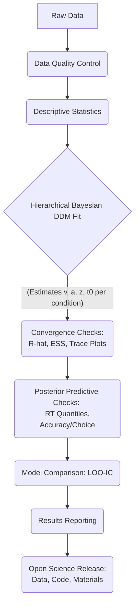

### Experimental Design Schematic
```mermaid
graph TD
    A[Experiment Start] --> B{4 Within-Subject Blocks};

    B --> C1(Block 1: Speed Instruction + High Base-Rate [70% Faces]);
    B --> C2(Block 2: Speed Instruction + Low Base-Rate [30% Faces]);
    B --> C3(Block 3: Accuracy Instruction + High Base-Rate [70% Faces]);
    B --> C4(Block 4: Accuracy Instruction + Low Base-Rate [30% Faces]);

    C1 --- S1[Evidence Levels: <br> - Real Faces <br> - Pareidolia <br> - Non-Faces];
    C2 --- S2[Evidence Levels: <br> - Real Faces <br> - Pareidolia <br> - Non-Faces];
    C3 --- S3[Evidence Levels: <br> - Real Faces <br> - Pareidolia <br> - Non-Faces];
    C4 --- S4[Evidence Levels: <br> - Real Faces <br> - Pareidolia <br> - Non-Faces];

    B --- O[Order of Blocks: Counterbalanced Across Participants];
```

### DDM Parameter Mapping
```mermaid
graph TD
    A[Stimulus/Task Factor] --> B(DDM Parameter);
    subgraph "Mapping Details"
        E_S[Evidence Strength] --> v_param(Drift Rate: v);
        D_I[Decision Instruction <br> (Speed vs Accuracy)] --> a_param(Boundary Separation: a);
        F_B[Face Base-Rate <br> (High vs Low)] --> z_param(Starting-Point Bias: z);
    end
```

### Analysis Pipeline Flowchart
